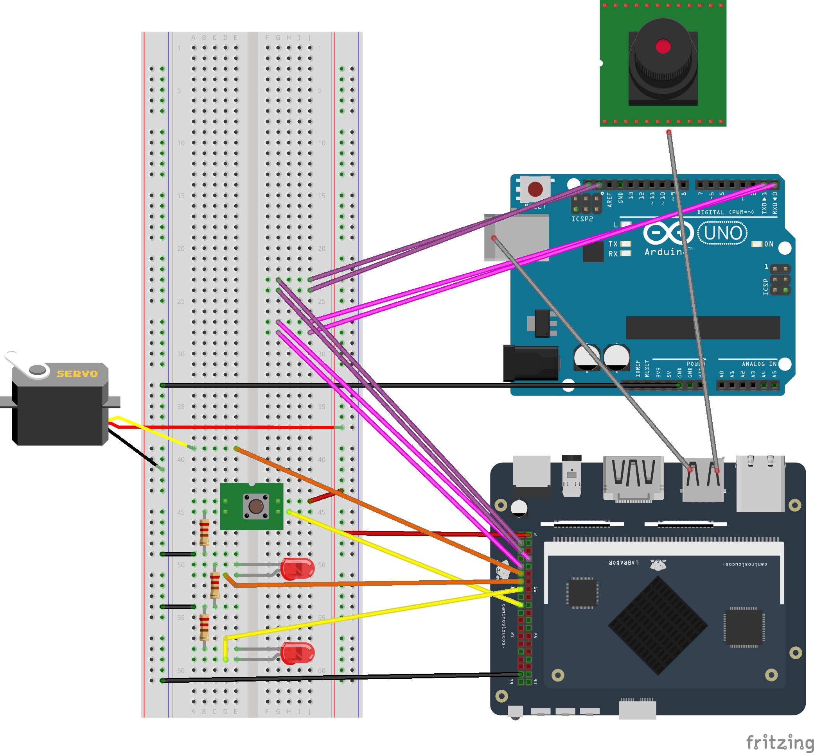

# Exemplos para uso da SDK

Esta pasta contém vários exemplos de uso da SDK. Confira o diagrama abaixo para fazer as conexões físicas, e então execute os exemplos com o comando `python3` (ou usando a sua IDE favorita).

Por exemplo, para piscar o LED ligado ao pino 15, execute:

```python
python3 gpio_led.py
```

Alguns exemplos requerem parâmetros, como por exemplo o do servo motor, que requer a posição em graus que se deseja posicionar o servo.

```python
python3 pwm_servo.py 180
```

Para entender os parâmetros necessários para executar cada exemplo, confira o respectivo código fonte.

